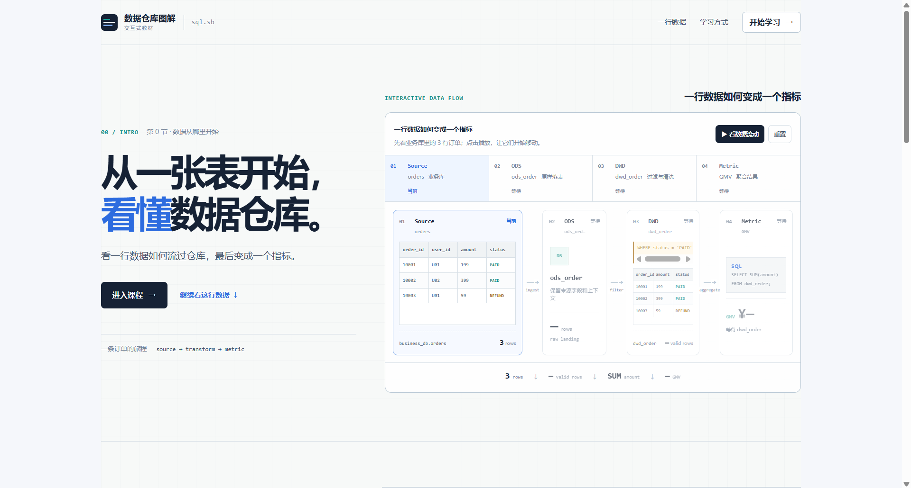
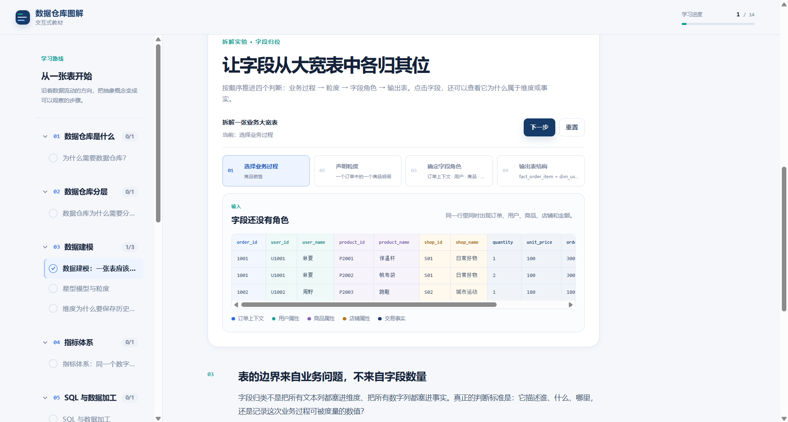
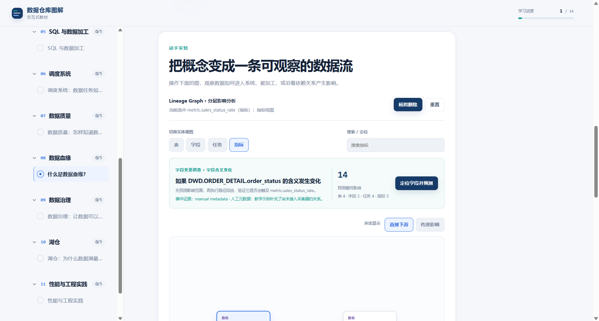

<div align="center">

# 数据仓库图解 (sql.sb)

> **从一张表开始，看懂数据仓库。**  
> 一套专为数据工程师与分析人员设计的交互式、可视化学习平台。

[](https://sql.sb)
[](https://sql.sb)
[](LICENSE)

<br />

### [👉 立即在线体验：sql.sb（免安装，浏览器开箱即用）](https://sql.sb)

</div>

---

## 为什么做这个项目？

很多数据仓库资料从缩写和概念定义（ODS / DWD / DWS / ADS、Kimball 维度建模、SCD）开始，但真实的工程痛点往往发生在数据流动的细节里：

- **数据如何流转**：业务库里分散的订单、用户、支付与库存明细，如何一步步加工成经营报表上的稳定指标？
- **为什么必须分层**：直接在大宽表上写分析 SQL 会遇到什么麻烦？为什么会引发数据膨胀与重复计算？
- **线上故障的波及范围**：修改维表的一个枚举值，下游究竟有多少张汇总表和仪表盘会静悄悄地出错？

**数据仓库图解**不堆砌静态的长篇概念。这里的每一节课都是一个**可阅读、可交互、可观察状态变化的实验沙盘**。你可以手动拖动时间轴、模拟任务故障、切换数据粒度，在数据状态的流动变化中建立系统性的工程认知。

---

## 核心交互实验一览

项目内置了 15+ 个针对真实数仓工程痛点打造的交互实验：

| 交互实验                    | 解决的工程疑问与操作体验                                                                              |
| :-------------------------- | :---------------------------------------------------------------------------------------------------- |
| 🧭 **贷款业务过程实验台**   | 沿着 LoanContract、LoanNote、Repayment 链路，区分合同签订、实际放款、还款和结清分别记录了哪件事。     |
| 🧩 **贷款 Grain 实验台**    | 切换合同、借据、还款三种 Grain，观察一行的身份如何决定金额落点，以及 Join 放大为什么会让指标算错。    |
| ⭐ **银行星型模型实验台**   | 从一笔账户交易归位字段，形成事实表和客户、账户、机构、产品、日期维度，再切换同一事实的观察角度。      |
| 📚 **三类事实表对照台**     | 对照 Transaction Fact、Periodic Snapshot Fact 和 Accumulating Snapshot Fact 的行含义与时间语义。      |
| ⏳ **客户历史版本时间机器** | 用 Customer 属性变更比较覆盖更新与拉链表，拖动时间点查看历史 LoanNote 如何命中当时的客户版本。        |
| ⏱️ **调度 DAG Run 模拟器**  | 沿时间轴推进依赖链路。真实模拟任务延迟到达、级联重试策略、下游阻断，以及指定分区的回滚与重跑。        |
| 🕸️ **血缘追踪与爆炸半径**   | 点击任意一张底表或字段，动态推演上游异常对下游报表与核心指标看板的连锁冲击，直观评估变更风险。        |
| 🚨 **数据质量决策台**       | 注入脏数据与空值样本，观察调度校验门控如何在数据进入汇总层前实现自动阻断与报警拦截。                  |
| ⚖️ **湖仓架构全景沙盘**     | 切换数据库、数据湖与湖仓三种架构，对比同一组订单事件在 Schema 约束、ACID 事务与存储成本上的工程权衡。 |

---

## 视觉预览

<div align="center">

### 从订单、用户、支付与库存业务表出发



### 亲手搭建星型模型与事实维度关联



### 点击观察全链路血缘与下游影响面



</div>

---

## 课程体系路线

平台按照生产数仓的建设链路设计了 12 个渐进式章节，目前包含 16 节课程和 15 个深度交互实验：

- **第 01 章：数据仓库是什么**（OLTP 业务账本 vs OLAP 独立分析空间）
- **第 02 章：数据仓库分层**（ODS → DWD → DWS → ADS 全流程流动模拟）
- **第 03 章：数据建模专题**
  - 业务过程：到底要记录哪件事？
  - Grain：一行究竟代表什么？
  - 事实、维度与星型模型
  - 事实表不只有一种
  - 维度为什么要保存历史？——拉链表
- **第 04 章：指标体系**（消除口径歧义：状态过滤、退款对齐与时间语义）
- **第 05 章：SQL 与数据加工**（分层快照与任务加工契约）
- **第 06 章：调度系统**（DAG 依赖、定时触发、故障重试与分区补数）
- **第 07 章：数据质量**（规则校验、异常证据链与发布闸门）
- **第 08 章：数据血缘**（表级与字段级血缘追踪、变更影响面分析）
- **第 09 章：数据治理**（资产盘点、字段策略与生命周期管理）
- **第 10 章：湖仓架构**（数据湖的灵活性与数仓治理能力的结合）
- **第 11 章：性能与工程实践**（分区裁剪与 Shuffle 数据倾斜模拟）
- **第 12 章：从 0 搭一套数据仓库**（_规划中_）

---

## 适合人群

- **数据工程师 / ETL 工程师**：系统性梳理数仓分层规范、建模范式、调度设计与治理思维。
- **后端工程师 / 架构师**：理解业务数据转入分析平台的流向与底层机制，看懂 OLAP 系统设计。
- **数据分析师 / BI 工程师**：深入理解底层数据模型与指标口径差异，搞清楚“数字为什么对不上”。
- **备战技术面试的学习者**：通过直观实验吃透 SCD2、粒度、DAG 调度、数据倾斜等高频工程考点。

---

## 本地运行

本项目基于静态站点生成架构，本地无须安装繁重的数据库或大数据环境：

```bash
# 1. 克隆仓库并安装依赖 (要求 Node.js >= 22.12)
git clone https://github.com/0verme/data-warehouse-visualized.git
cd data-warehouse-visualized
npm install

# 2. 启动本地开发服务
npm run dev

# 3. 访问本地页面
# 打开 http://localhost:4321
```

<details>
<summary><b>查看项目目录结构与常用命令</b></summary>

```bash
npm run test         # 运行 Vitest 单元测试
npm run lint         # 运行 ESLint 静态代码检查
npm run format:check # 检查 Prettier 代码格式
npm run build        # 构建静态站点产物 (dist/)
npm run preview      # 本地预览生产构建
```

```text
src/
├── components/
│   ├── course/          # 学习 Shell、目录与进度交互
│   ├── lesson/          # LessonHeader、卡片、代码块与课程导航
│   └── visualizations/  # 数据驱动的交互可视化组件
├── content/             # 每节课的文案与实验输入数据
├── data/                # Lesson Schema、课程元数据与章节路线
├── i18n/                # Locale 定义与公共 UI 文案
├── layouts/             # 网站级 Astro Layout 与 SEO 配置
├── pages/               # 首页、学习入口与动态 Lesson 路由
├── styles/              # 全局样式、CSS Variables 与响应式规则
├── types.ts             # 可视化通用数据模型类型定义
└── utils/               # 课程导航、进度持久化、血缘与调度计算
```

</details>

> **生产构建与部署**：  
> 完整的生产构建规范、CI/CD 自动化流水线以及 Cloudflare Workers 部署说明，请参阅 [部署指南 (docs/DEPLOYMENT.md)](docs/DEPLOYMENT.md)。

---

## 参与贡献

欢迎围绕课程内容、新的交互模拟器、工程案例、无障碍体验和性能优化提交 Issue 或 Pull Request！

新增内容建议：

1. **文案与组件分离**：课程文字统一维护在 `src/content/lessons/`，业务展示文本与底层组件解耦。
2. **组件复用**：优先复用数据驱动的可视化组件体系。
3. **单元测试**：核心数据计算、状态推演与血缘调度逻辑需补充 Vitest 测试验证。
4. **轻量纯粹**：避免引入与交互教学无关的重量级外部依赖。

---

## 开源协议

本项目源代码基于 [Apache License 2.0](LICENSE) 协议开源。

课程内容、教学文案、图解及其他教育材料的版权归原作者所有。
